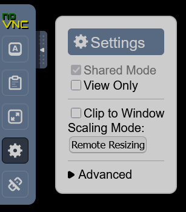

# CRIMAC-LSSS-cloud

Docker image for running LSSS in with a web-based desktop (noVNC).

## Run with Docker

```sh
docker build -t lsss-novnc .
docker run -d \
  --name lsss-novnc \
  -p 8080:6080 \
  -p 5900:5900 \
  -e SCREEN_RESOLUTION=1366x768 \
  -v "$(pwd)/lsss:/lsss" \
  -v "$(pwd)/path/to/datastore1:/lsss/datastore1" \
  -v "$(pwd)/path/to/datastore2:/lsss/datastore2" \
  --restart unless-stopped \
  lsss-novnc
```

## Run with Docker Compose
Edit `docker-compose.yml` as needed, then run:

```sh
docker compose up -d
```

### Example docker-compose.yml
```yaml
services:
  lsss-novnc:
    container_name: lsss-novnc
    build:
      context: .
      dockerfile: Dockerfile
    ports:
      - "8080:6080" # HTTP Web user interface
      - "5900:5900" # Optional, VNC server port
    environment:
      - SCREEN_RESOLUTION=1366x768
    volumes:
      - ./lsss:/lsss # Main LSSS directory
      - ./path/to/datastore1:/lsss/datastore1 # Optional 1, replace with actual path
      - ./path/to/datastore2:/lsss/datastore2 # Optional 2, replace with actual path
    restart: unless-stopped
```

## Access the desktop
- Open [http://localhost:8080/](http://localhost:8080/) in your browser. You will be redirected to the noVNC client.
- The desktop resolution can be set with the `SCREEN_RESOLUTION` environment variable (default: 1366x768).
- To connect with a VNC client, use port 5900.

## Scaling the resolution to fit the browser window.

- Open the noVNC pop-out and select settings
- Check the Clip to Window
- Set the Scaling Mode to Remote Resizing



## Notes
- The container will auto-start LSSS and provide an Openbox desktop environment.
- You can right-click the desktop for the Openbox menu (including a terminal emulator).
- Data directories can be mounted using the `volumes` section in Docker Compose.